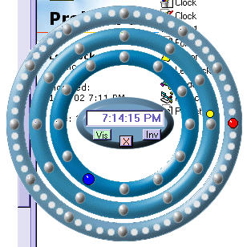



## Led Clock with transparent bg

### Description

This is a more novel led clock than my previous clock. The Auto Shape form code is Mr.Lakes that makes the bg transparent.It is very easy to use.Hope you like the clock.I always like comments.
 
### More Info
 

             |
---                |---
**Submitted On**   |2002-10-07 19:16:20
**By**             |[Kenneth Foster](https://github.com/Planet-Source-Code/PSCIndex/blob/master/ByAuthor/kenneth-foster.md)
**Level**          |Beginner
**User Rating**    |4.9 (39 globes from 8 users)
**Compatibility**  |VB 6\.0
**Category**       |[Complete Applications](https://github.com/Planet-Source-Code/PSCIndex/blob/master/ByCategory/complete-applications__1-27.md)
**World**          |[Visual Basic](https://github.com/Planet-Source-Code/PSCIndex/blob/master/ByWorld/visual-basic.md)
**Archive File**   |[Led\_Clock\_1423351072002\.zip](https://github.com/Planet-Source-Code/kenneth-foster-led-clock-with-transparent-bg__1-39632/archive/master.zip)

